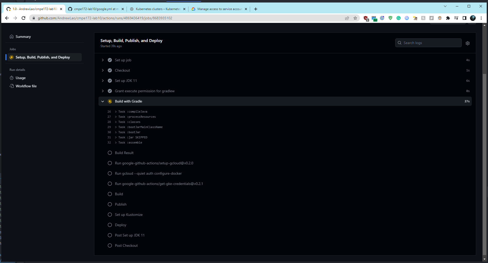

# CMPE 172 - Lab #10 Notes

# CI Builds

Workflow for CI on GitHub by using the new workload button on GitHub actions
and selecting the Java Gradle workflow. This workflow was then modified with 
the configurations given on Canvas.

Build in progress for gumball

Build complete for gumball

# GKE 

GKE cluster created

Service account created by using the built-in menu on GCP

IAM service roles configured to add Kubernetes Engine Developer and Storage Admin roles

GCP Project ID on Dashboard to be entered on GitHub as a variable

Secret Key Created and shown below in the downloaded format to be entered as a variable on GitHub

Deployment variables created on GitHub

Screenshots showing deployment in progress

Screenshots showing completed deployment

Spring Gumball Workload created and Jumpbox created to test the application connectivity

GKE service for gumball running

GKE ingress created for gumball and running using port 80 and connecting to port 8080 backend

GKE gumball deployed using GKE

